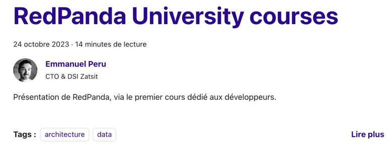

# Posting in **zatsit** Blog

> Remember that the official documentation of docusaurus is the reference.

Docusaurus proposes file conventions to make blog posts, but we added a top level folder hierarchy to categorize posts
(and change the way we name file blog post) :

- [ai](blog%2Fai)
- [architecture](blog%2Farchitecture)
- [cloud](blog%2Fcloud)
- [data](blog%2Fdata)
- [dev](blog%2Fdev)
- [general](blog%2Fgeneral)
- [green](blog%2Fgreen)
- [mobile](blog%2Fmobile)
- [ops](blog%2Fops)
- [web](blog%2Fweb)

> If you think you need a new category, please contact [DT](mailto:dirtech@zatsit.fr).

> If you think your post belongs to more than one category, choose the main one to create it. 
> Don't worry, tags in your post will help Docusaurus to index it. 

## Create a post for the first time

First of all, pull the project repository and create a branch like "feat/category-YYYYMMDD-SLUG"
> SLUG will be your future URI

```sh
git clone xxxxx
git branch -c feat/category-YYYYMMDD-MyTitle
```

> We are using the conventional commits way, so you have to follow the [conventional commits](https://www.conventionalcommits.org/en/v1.0.0/) to name your branch.

You are ready to write !

> For further information about the available Markdown functionalities, please read the [official documentation](https://docusaurus.io/fr/docs/next/markdown-features).

### Add your author information

Go to the [authors.yml file](authors/authors.yml), you will have to create your author's information bloc : 

The first entry follow the same convention in all other **zatsit** software usage : 
- everything in lowercase
- first letter of your first name
- your name
- add your profil picture (in the `.webp` format) into the `authors/img` folder

This value will be used in your post metadata.

```yml
jdoe:
  name: John Doe
  title: Site Reliability Engineer  @ **zatsit**
  url: Github account or Linkedin account
  image_url: /img/authors/your_picture.webp
```

Then in your category folder (under [the blog folder](./blog)) create a folder like : `YYYY-MM-DD-SLUG`, where SLUG 
will be used by the Docusaurus router (in fact, it the 'slug' property in your post that router will use, 
but by convention we use it in the folder naming).


```sh
cd blog
cd category
mkdir YYYYMMDD-SLUG
touch index.md
vim index.md (it is a joke)
```
Then with your favourite IDE, you can edit your `index.md` file following this example

```md
---
slug: zatsit-blog
title: Zatsit blog introduction
authors: [jdoe]
tags: 
  - "architecture"
  - "web"
---
```

After this section you have few lines to sum up your post, it will be used in list page.
For example : 

```md
---

Présentation de RedPanda, au travers du premier cours dédié aux développeurs de la "RedPanda University".

<!-- truncate -->
```
will result like this : 


Then you can follow [this guide](https://www.markdownguide.org/basic-syntax/) to format your post if you are not markdown fluent.

### Using pictures

All your pictures for your post have to be stored in your post folder, feel free to create subfolders if you want.

> Do not forget alternative test for accessibility.

> Do not forget to credit your pictures according to the licence of the picture.

> Ideally, you should use the `webp` or `avif` format for your pictures, but if you have to use another format, please use the smallest size possible.

### Add social media link

In this version, the minimalist solution found to add link to share on `X` and `LinkedIn` is to copy/paste this two lines, customizing the query attribute, for example : 
```
[](https://www.linkedin.com/sharing/share-offsite/?url=https%3A%2F%2Fzatsit-blog.web.app%2Fblog%2Fredpanda-introduction%2F)
[](https://twitter.com/intent/tweet?text=Pr%C3%A9sentation%20de%20RedPanda%2C%20au%20travers%20du%20premier%20cours%20d%C3%A9di%C3%A9%20aux%20d%C3%A9veloppeurs%20de%20la%20%22RedPanda%20University%22%20que%20j%27ai%20suivi%2C%0Aje%20vous%20pr%C3%A9sente%20les%20grands%20principes%20et%20les%20premiers%20pas%20dans%20cet%20%C3%A9cosyst%C3%A8me&url=https%3A%2F%2Fzatsit-blog.web.app%2Fblog%2Fredpanda-introduction%2F)

```
Take care of the relative path of the two social icons, regarding the folders in the category.
- For `LinkedIn` and `X` : the url of your post use the root of the blog and your slug. You have to encode your url (you can use [URL Encoder](https://www.urlencoder.org/)
- For `X` only : encode the description of your post too.

### Add a video link in your post

We don't want to use the iframe way to add a video in our post, because it is not performant (and so, not green). So the idea is to link the video with a picture, and the picture will be the link to the video.

- get the YouTube Thumbnail from [https://www.get-youtube-thumbnail.com](https://www.get-youtube-thumbnail.com), and store it in your post folder.
- Link the video with this example snippet (that is used in the [AsyncAPI post](/blog/architecture/2023-12-21-AsyncAPI-3/index.md))

Format:
```
[](<link to the youtube video>)
```
Example:
```
[](https://www.youtube.com/watch?v=WCK9_ZDv6K4)
```

## Visualise the blog post by submitting a pull request

You can have a first preview like any markdown preview from your favorite IDE. The preview will be very similar to the final result.

When you are ready to submit your post, you can create a pull request. A Github Actions workflow will generate
a previous URL for you in order to visualize your post in an ephemeral blog instance.

