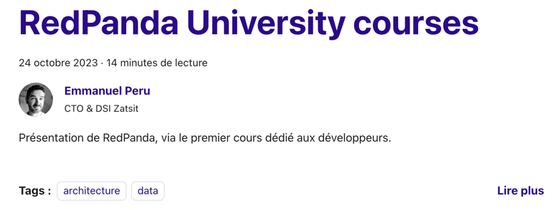

# Posting in **zatsit** Blog

> The blog is rendered by the [zats-blog](https://github.com/zatsit-oss/zats-blog) Astro shell, which reads this
> repository in place. What it supports, and nothing more, is described below.

Posts are grouped in a top level folder per category. The folder an article sits in **is** its category:

- [ai](blog%2Fai)
- [architecture](blog%2Farchitecture)
- [cloud](blog%2Fcloud)
- [data](blog%2Fdata)
- [dev](blog%2Fdev)
- [general](blog%2Fgeneral)
- [green](blog%2Fgreen)
- [mobile](blog%2Fmobile)
- [ops](blog%2Fops)
- [web](blog%2Fweb)

> If you think you need a new category, please contact [DT](mailto:dirtech@zatsit.fr).

> If you think your post belongs to more than one category, choose the main one to create it. 
> Don't worry, tags in your post will index it across categories. 

## Create a post for the first time

First of all, pull the project repository and create a branch like "feat/category-YYYYMMDD-SLUG"
> SLUG will be your future URI

```sh
git clone xxxxx
git branch -c feat/category-YYYYMMDD-MyTitle
```

> We are using the conventional commits way, so you have to follow the [conventional commits](https://www.conventionalcommits.org/en/v1.0.0/) to name your branch.

You are ready to write !

> Posts are plain Markdown (no MDX): standard syntax, GFM tables and code blocks, plus the admonitions and
> the display math described below.

### Add your author information

Go to the [authors.yml file](authors/authors.yml), you will have to create your author's information bloc : 

The first entry follow the same convention in all other **zatsit** software usage : 
- everything in lowercase
- first letter of your first name
- your name
- add your profil picture (in the `.webp` format) into the `authors/img` folder

This value will be used in your post metadata.

```yml
jdoe:
  name: John Doe
  title: Site Reliability Engineer  @ **zatsit**
  url: Github account or Linkedin account
  image_url: /img/authors/jdoe.webp
```

> The avatar is found by **file name**: `authors/img/jdoe.webp` for the key `jdoe`. Name the file after your key.

Then in your category folder (under [the blog folder](./blog)) create a folder like : `YYYY-MM-DD-slug`.
The date in the folder name is the publication date when the frontmatter has no `date`. The URL comes from
the `slug` property of your post, served at `/<slug>/`; by convention, the folder uses the same slug.


```sh
cd blog
cd category
mkdir YYYY-MM-DD-slug
touch index.md
vim index.md (it is a joke)
```
Then with your favourite IDE, you can edit your `index.md` file following this example

```md
---
slug: zatsit-blog (your future uri)
title: Zatsit blog introduction (Title of the post)
authors: [jdoe] (all your posts will be indexed with the key)
date: 2024-06-21 (the publication date)
tags: (to be categorized)
  - "architecture"
  - "web"
---
```

The attributes definition : 

| Key        | Value                           |
|------------|-----------------------------------|
| slug       | Your future uri                  |
| title      | Title of the post |
| authors    | All your posts will be indexed with your author name, refers to the key in the authors.yml file |
| date       | Optional. The publication date, defaults to the date of the folder name (take care of the value during PR reviewing) |
| tags       | To be categorized              |
| description | Optional. Summary for the list page and search engines, replaces the text above `<!-- truncate -->` |
| shareText  | Optional. Text of the X share link, defaults to the title |
| draft      | Optional. `true` to keep the post unpublished |


After this section you have few lines to sum up your post, it will be used in list page.
For example : 

```md
---

Présentation de RedPanda, au travers du premier cours dédié aux développeurs de la "RedPanda University".

<!-- truncate -->
```
will result like this : 


Then you can follow [this guide](https://www.markdownguide.org/basic-syntax/) to format your post if you are not markdown fluent.

### Using pictures

All your pictures for your post have to be stored in your post folder, feel free to create subfolders if you want.
Reference them with a relative path (`./my-picture.webp`): the shell repository is a separate checkout, so a path
pointing outside your post folder, or to an external URL, will not be optimised and may break.

> Do not forget alternative test for accessibility.

> Do not forget to credit your pictures according to the licence of the picture.

> Ideally, you should use the `webp` or `avif` format for your pictures, but if you have to use another format, please use the smallest size possible.

### Using admonitions 

Using abmonitions provide a way to set visual take-away for the readers that is pretty cool !

Wrap your text between two `:::` lines, the opening one naming the type. An optional title goes in brackets:

```md
:::tip

Le plugin Maven OpenRewrite permet également d'enchaîner des recettes.

:::

:::warning[Titre choisi]

Un point d'attention.

:::
```

Supported types: `note`, `info`, `tip`, `warning`, `caution`, `danger`. Any other type fails the build.


### Add social media link

Nothing to do: the share links to `LinkedIn` and `X` are added automatically at
the bottom of every article by the `ShareLinks` component of the site shell. The
URL is derived from your `slug`, so it can no longer drift from the article it
points at.

The share text defaults to the article title. To write your own, add an optional
`shareText` to the frontmatter:

```yml
---
slug: redpanda-introduction
title: Premier cours de RedPanda
shareText: "Présentation de RedPanda, au travers du premier cours dédié aux développeurs de la RedPanda University"
---
```

Do not paste the old two-line snippet: its relative paths pointed into the
shell's `static/` folder, which the content repository no longer sits inside.

### Add a video link in your post

We don't want to use the iframe way to add a video in our post, because it is not performant (and so, not green). So the idea is to link the video with a picture, and the picture will be the link to the video.

- get the YouTube Thumbnail from [https://www.get-youtube-thumbnail.com](https://www.get-youtube-thumbnail.com), and store it in your post folder.
- Link the video with this example snippet (that is used in the [AsyncAPI post](/blog/architecture/2023-12-21-AsyncAPI-3/index.md))

Format:
```
[](<link to the youtube video>)
```
Example:
```
[](https://www.youtube.com/watch?v=WCK9_ZDv6K4)
```

## Visualise the blog post by submitting a pull request

You can have a first preview like any markdown preview from your favorite IDE. The preview will be very similar to the final result.

When you are ready to submit your post, you can create a pull request. A Github Actions workflow will generate
a previous URL for you in order to visualize your post in an ephemeral blog instance.

## Use mathematical representation  

You can write a mathematical formula with the [KaTeX / LaTeX syntax](https://katex.org/docs/supported), as a block
between two `$$` lines. It is rendered as MathML, with no script nor font to load.

```md
$$
\text{WUE} = \frac{\text{Annual Site Water Usage (liters)}}{\text{IT Equipment Annual Energy Use (kWh)}}
$$
```

> Only display math is supported: a single `$` stays literal text, so prices and shell prompts are safe.
