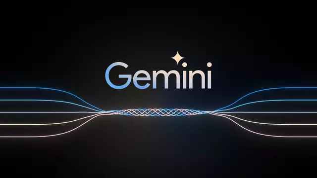

Google annonce la disponibilité publique de Gemini Pro sur Vertex AI, disponible en trois tailles : Ultra, Pro et Nano.

<!-- truncate -->

# Google annonce la disponibilité publique de Gemini Pro sur Vertex AI

Il y a une semaine, Google a dévoilé Gemini, son modèle d'IA le plus puissant et flexible à ce jour, disponible en trois tailles : Ultra, Pro et Nano. 
> Aujourd'hui, nous sommes ravis d'annoncer que Gemini Pro est désormais accessible publiquement sur Vertex AI, la plateforme d'IA de bout en bout de Google Cloud, comprenant des outils intuitifs, une infrastructure entièrement gérée et des fonctionnalités intégrées de confidentialité et de sécurité. Avec Gemini Pro, les développeurs peuvent désormais créer des "agents" capables de traiter et d'agir sur des informations.

## Créez des agents d'IA de qualité professionnelle à grande échelle avec Gemini Pro sur Vertex AI

Vertex AI permet de personnaliser et de déployer Gemini, donnant aux développeurs le pouvoir de créer de nouvelles applications différenciées capables de traiter des informations à travers le texte, le code, les images et la vidéo. Avec Vertex AI, les développeurs peuvent :

- Découvrir et utiliser Gemini Pro, ou choisir parmi une liste sélectionnée de plus de 130 modèles de Google, open source et de tiers, répondant aux normes strictes de sécurité et de qualité de l'entreprise. Les développeurs peuvent accéder aux modèles via des API faciles à utiliser pour les intégrer rapidement dans des applications.
  
- Personnaliser le comportement du modèle avec une expertise spécifique au domaine ou à l'entreprise, en utilisant des outils de réglage pour enrichir les connaissances de formation et ajuster même les poids du modèle lorsque cela est nécessaire. Vertex AI propose une variété de techniques de réglage, notamment la conception de prompt, le réglage basé sur l'adaptateur tel que Low Rank Adaptation (LoRA), et la distillation. Nous offrons également la possibilité d'améliorer un modèle en capturant les commentaires des utilisateurs grâce à notre prise en charge de l'apprentissage par renforcement à partir des commentaires humains (RLHF).
  
- Augmenter les modèles avec des outils pour aider à adapter Gemini Pro à des contextes ou des cas d'utilisation spécifiques. Les extensions et connecteurs Vertex AI permettent aux développeurs de lier Gemini Pro à des API externes pour des transactions et d'autres actions, de récupérer des données à partir de sources externes ou d'appeler des fonctions dans des bases de code. Vertex AI offre également aux organisations la possibilité d'ancrer les sorties du modèle de base dans leurs propres sources de données, contribuant ainsi à améliorer la précision et la pertinence des réponses du modèle.
  
- Gérer et mettre à l'échelle les modèles en production avec des outils spécialement conçus pour garantir que, une fois les applications construites, elles peuvent être facilement déployées et entretenues. À cette fin, nous introduisons une nouvelle façon d'évaluer les modèles appelée Automatic Side by Side (Auto SxS), un outil automatisé à la demande pour comparer les modèles. Auto SxS est plus rapide et plus rentable que l'évaluation manuelle des modèles, ainsi que personnalisable pour différentes spécifications de tâches afin de traiter de nouveaux cas d'utilisation de l'IA générative.
  
- Construire des agents de recherche et de conversation dans un environnement à faible code / sans code. Avec Vertex AI, les développeurs de tous niveaux de compétence en apprentissage automatique pourront utiliser Gemini Pro pour créer des agents d'IA engageants de qualité professionnelle en quelques heures et jours au lieu de semaines et mois. Prochainement, Gemini Pro sera une option pour alimenter les fonctionnalités de résumé de recherche et de génération de réponses dans Vertex AI, améliorant ainsi la qualité, la précision et les capacités d'ancrage des applications de recherche. Gemini Pro sera également disponible en version preview en tant que modèle de base pour les agents de conversation vocale et de chat, offrant des interactions dynamiques avec les utilisateurs et prenant en charge un raisonnement avancé.
  
- Proposer de l'innovation de manière responsable en utilisant les filtres de sécurité de Vertex AI, les API de modération de contenu et d'autres outils d'IA responsables pour aider les développeurs à s'assurer que leurs modèles ne produisent pas de contenu inapproprié.
  
- Aider à protéger les données avec les contrôles de gouvernance des données et de confidentialité intégrés de Google Cloud. Les clients restent maîtres de leurs données, et Google n'utilise jamais les données des clients pour former nos modèles. Vertex AI offre une variété de

## Indemnisation sur les sorties de modèles générées

L'approche complète de Google en matière d'IA est conçue pour aider à maintenir la sécurité et la protection de nos clients. Nous adoptons une approche d'indemnisation à deux volets, une première dans l'industrie, pour donner aux clients de Cloud la tranquillité d'esprit lors de l'utilisation de nos produits d'IA générative. Aujourd'hui, nous étendons notre indemnisation sur les sorties générées pour inclure également les sorties de modèles de PaLM 2 et Vertex AI Imagen, en plus d'une indemnisation sur les réclamations liées à notre utilisation des données d'entraînement. La couverture d'indemnisation est prévue pour l'API Gemini lorsqu'elle deviendra généralement disponible.

## Bienvenue dans l'ère Gemini - commençons à construire

L'API Gemini est maintenant disponible. Gemini Pro est également disponible sur Google AI Studio, un outil basé sur le web qui aide à développer rapidement des invites. Nous rendrons Gemini Ultra disponible pour certains clients, développeurs, partenaires et experts en sécurité et responsabilité pour des expérimentations et des commentaires précoces avant de le déployer auprès des développeurs et des clients d'entreprise début de l'année prochaine.

