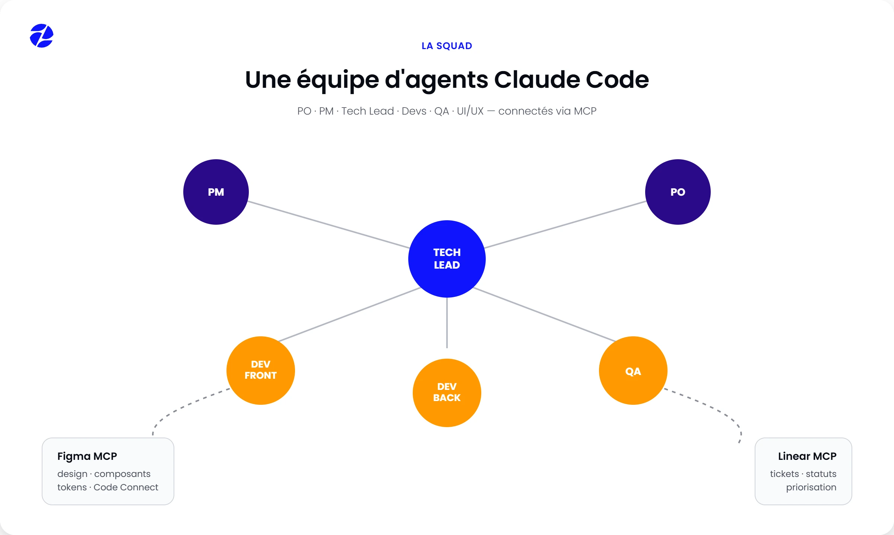
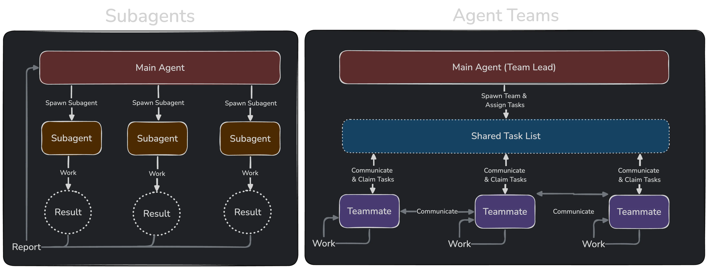
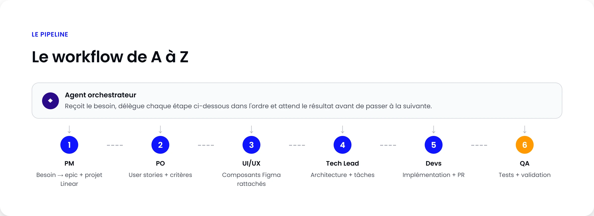

Comment transformer Claude Code en véritable squad produit : un agent par rôle (PO, PM, Tech Lead, Devs, QA, UI/UX), connecté à Figma et Linear via MCP, pour livrer une fonctionnalité de l'idée jusqu'au code testé, sans copier-coller de specs entre outils.



<!-- truncate -->

:::info

Cet article s'appuie sur Claude Code, mais la logique s'applique à n'importe quel assistant IA, chaque chemin `.claude/agents`, peut être remplacé par la convention propre à votre outil.

:::

## Monter une équipe d'agents avec Claude Code

Claude Code n'est plus seulement "un assistant qui code dans le terminal". Avec les **subagents**, les **skills**, les **hooks**, et les serveurs **MCP** (Model Context Protocol), on peut construire quelque chose qui ressemble à une vraie squad produit, sauf que chaque rôle est un agent spécialisé, avec son propre contexte, ses propres outils, et une mission bien définie.

J'ai fini par structurer une "équipe" de six agents (PO, PM, Tech Lead, Devs, Testeurs, UI/UX Designer) autour de Claude Code, connectée à **Figma** pour le design et **Linear** pour le ticketing. Pas parce que c'était le plan de départ : au début je n'avais qu'un seul agent générique, et je passais mon temps à lui répéter le contexte du projet à chaque nouvelle tâche. 
Découper mes actions en rôles a réglé ça presque par hasard. 
Je vous explique comment j'ai construit tout ça, et où ça coince encore.


## Subagents ou Agent Teams ?

Deux briques Claude Code rendent ça possible, et elles ne se valent pas pour tous les usages.

Les **subagents** sont des assistants spécialisés, définis en Markdown avec un frontmatter (nom, description, outils autorisés), stockés dans `.claude/agents/` (au niveau projet) ou `~/.claude/agents/` (au niveau utilisateur). Chaque subagent tourne dans sa propre fenêtre de contexte, avec un system prompt dédié et un accès aux outils restreint. Claude délègue automatiquement une tâche au subagent dont la description correspond, ou vous l'invoquez explicitement.

Les **Agent Teams**, plus récentes et encore en évolution rapide, proposent un modèle où plusieurs agents collaborent activement, se répartissent le travail et se débloquent mutuellement, un peu comme un sprint Scrum plutôt qu'un simple MapReduce de workers indépendants. J'ai testé, et honnêtement ce n'est pas encore le confort auquel on s'attend : les reprises de session sont fragiles et la consommation de tokens grimpe vite dès que plusieurs agents discutent entre eux.

:::tip

[Documentation officielle des Agents Teams Claude](https://code.claude.com/docs/fr/agent-teams)

:::



Pour une squad produit complète, l'analogie la plus juste reste : le PO/PM/Tech Lead orchestrent, les devs et testeurs exécutent en parallèle.

:::tip

Commencez avec de simples **sous-agents**, c'est plus simple et plus stable. Ne migrez vers les Agent Teams que si le travail exige vraiment des échanges continus entre agents en cours de tâche.

:::


## Définir les rôles

Chaque rôle devient un fichier `.claude/agents/<role>.md` avec un frontmatter qui déclare 
* `name` : l'identifiant de l'agent
* `description` : ce qui déclenche sa délégation automatique
*  et `tools`/`disallowedTools` : les outils qu'il a le droit d'utiliser (Un PO ne devrait pas avoir accès à `Write`/`Edit` sur le code, un dev n'a pas forcément besoin d'écrire dans Linear directement, etc).
:::tip

[Documentation officielle des sous-agents](https://code.claude.com/docs/fr/sub-agents)

:::

Ce qui donne dans notre contexte : 

**Product Manager** (`pm.md`) : porte la vision produit, arbitre les priorités, découpe en épics/releases, garde la cohérence globale. Accès Linear (projets, roadmap), lecture Figma.

```markdown
---
name: pm
description: Porte la vision produit, arbitre les priorités, découpe un besoin en épics. À invoquer pour tout cadrage produit de haut niveau.
tools: Read, Grep, Glob, mcp__linear
---

Tu es le Product Manager de l'équipe. Pour chaque besoin reçu :
1. Vérifie qu'il s'inscrit dans la roadmap produit.
2. Formalise le besoin en épic, avec son objectif métier.
3. Cherche dans Linear un projet existant correspondant avant d'en créer un. Réutilise-le si trouvé, crée-le sinon.
...
```

**Product Owner** (`po.md`) : traduit un besoin métier en user stories priorisées, avec critères d'acceptation clairs. Accès Linear en lecture/écriture, pas d'accès au code.

```markdown
---
name: po
description: Traduit un besoin métier en user stories priorisées avec critères d'acceptation. À invoquer pour tout découpage fonctionnel.
tools: Read, Grep, Glob, mcp__linear
---

Tu es le Product Owner de l'équipe. Pour chaque besoin reçu :
1. Rédige des user stories au format "En tant que... je veux... afin de...".
2. Ajoute des critères d'acceptation clairs et testables pour chacune.
3. Priorise les stories (must-have / should-have / nice-to-have).
...
```

**Tech Lead** (`tech-lead.md`) : traduit les stories en tâches techniques, définit l'architecture, fait les choix techniques (Vue 3/TS, structure des composants, conventions), reviewe le travail des devs. Accès lecture/écriture code, Linear, Figma (design system, variables).

```markdown
---
name: tech-lead
description: Traduit les user stories Linear en tâches techniques, définit l'architecture, review le code des devs. À invoquer pour toute décision d'architecture ou de découpage technique.
tools: Read, Grep, Glob, Bash, Edit, Write, mcp__figma, mcp__linear
---

Tu es le Tech Lead de l'équipe. Stack : Vue 3 + TypeScript (front), Node.js (back).
Avant toute implémentation, tu dois :
1. Lire le ticket Linear associé et ses critères d'acceptation.
2. Traiter les détails de design (couleurs, positions, composants) déjà écrits par l'agent UI/UX comme la source de vérité design, et n'ouvrir Figma toi-même que pour les contraintes techniques/responsive non couvertes.
3. Découper la story en tâches techniques atomiques, une par composant/endpoint.
4. Chercher dans Linear une sous-tâche existante correspondante avant d'en créer une.
```

:::tip

Pour pousser ce Tech Lead vers plus de spécialisation (conventions Vue 3/TypeScript, patterns Node.js, bonnes pratiques...), passez par des **skills** dédiés plutôt que par un prompt system toujours plus long. 
Créez un skill par convention/stack, puis référencez-le dans le frontmatter de l'agent (champ `skills`). Le Tech Lead les charge à la demande, sans alourdir son contexte.

:::

**Devs** (`dev-frontend.md`, `dev-backend.md`) : implémentent les tâches assignées, en s'appuyant sur le contexte Figma (composants, tokens) et les specs Linear. Accès code complet, Figma en lecture, Linear pour mettre à jour le statut des tickets.

```markdown
---
name: dev-frontend
description: Implémente les tâches frontend assignées par le Tech Lead (Vue 3 + TypeScript). À invoquer pour toute tâche de composant UI.
tools: Read, Grep, Glob, Bash, Edit, Write, mcp__linear
---

Tu es développeur frontend. Stack : Vue 3, TypeScript.
Pour chaque tâche reçue :
1. Passe le ticket Linear en "In Progress" avant de commencer.
2. Lis le contexte Linear associé, y compris les détails de design propagés par le Tech Lead depuis l'agent UI/UX.
3. Implémente le composant en respectant les design tokens (pas de couleur en dur).
4. Une fois terminé, passe le ticket en "In Review".
```

**Testeurs** (`qa.md`) : écrivent et exécutent les tests (unitaires, e2e), valident les critères d'acceptation de la story, ouvrent des tickets de bug dans Linear si un écart est détecté. Accès code (lecture + tests), exécution de commandes (Bash), Linear.

```markdown
---
name: qa
description: Écrit et exécute les tests, valide les critères d'acceptation d'une story, ouvre des bugs Linear si besoin. À invoquer pour toute validation de story.
tools: Read, Grep, Glob, Bash, Edit, mcp__linear
---

Tu es le QA de l'équipe. Pour chaque story à valider :
1. Relis les critères d'acceptation du ticket Linear.
2. Écris les tests correspondants (unitaires et/ou e2e).
3. Exécute-les.
4. En cas d'écart, ouvre un ticket de bug Linear avec une reproduction détaillée, taggé selon la zone concernée (`Frontend`, `Backend`, `Database`, ...).
```

**UI/UX Designer** (`ui-ux.md`) : c'est le rôle le plus particulier, puisque Claude Code ne dessine pas dans Figma à votre place de façon autonome. Mais avec le serveur MCP Figma, il peut lire les maquettes, extraire les composants/variables/design tokens, et même écrire sur le canvas (créer/mettre à jour des frames, composants, styles).

```markdown
---
name: ui-ux
description: Extrait le contexte design Figma (composants, couleurs, positions, variables) d'une story, et écrit les détails d'implémentation frontend dans les tickets Linear. À invoquer pour tout besoin de contexte design.
tools: Read, Grep, Glob, Edit, Write, mcp__figma, mcp__linear
---

Tu es l'UI/UX Designer de l'équipe. Le design de référence est le fichier Figma fourni pour ce projet. Pour chaque story reçue :
1. Extrais du design Figma les composants, couleurs, positions et variables pertinents pour la story.
2. Écris ces détails dans le ticket Linear correspondant sous un format structuré fixe, un bloc par composant.
3. Capture une image de la frame Figma concernée et attache-la au même ticket Linear.
```

:::tip

Depuis l'arrivée de **Claude Design**, ce rôle peut aussi s'appuyer directement sur ce produit plutôt que de tout faire passer par Figma. Claude Design génère prototypes, wireframes et maquettes en langage naturel. Le pont design ↔ code devient plus court, sans repasser systématiquement par un aller-retour Figma.

:::


## Connecter les outils externes via MCP

C'est la brique qui transforme cette équipe d'agents en véritable pipeline produit : sans MCP, vos agents "discutent" du produit ; avec MCP, ils lisent et écrivent dans vos vrais outils. 

:::note

Si le protocole vous semble encore flou, la [spec officielle MCP](https://modelcontextprotocol.io/introduction) vaut le détour, tout comme la [doc MCP de Claude Code](https://docs.claude.com/fr/docs/claude-code/mcp) pour la partie configuration côté CLI.

:::

### Figma

Figma propose un serveur MCP en deux versions : une version distante (recommandée, la plus complète, hébergée par Figma) et une version desktop, réservée à des cas d'usage entreprise spécifiques, qui nécessite l'app Figma ouverte en local.

Pour la version distante, dans Claude Code :

```bash
claude mcp add --transport http figma https://mcp.figma.com/mcp
```

Puis dans une session Claude Code, tapez `/mcp`, sélectionnez `figma`, `Authenticate`, et autorisez l'accès dans le navigateur.

Une fois connecté, vos agents peuvent extraire le contexte d'un frame ou d'une sélection (composants, variables, layout, contenu FigJam), générer du code aligné avec vos composants réels grâce à Code Connect, ou encore écrire directement sur le canvas Figma. C'est pratique pour que le Tech Lead ou le designer synchronisent un prototype codé vers Figma pour revue d'équipe.

:::note

Le mode de référence le plus fiable reste le lien Figma (clic droit sur un frame → "Copy link to selection") passé dans le prompt, plutôt que de compter sur la sélection en direct dans l'app, qui décroche plus souvent qu'on ne le voudrait.

:::

### Linear

Linear propose également un serveur MCP officiel, hébergé, avec authentification OAuth, donc pas de token à gérer manuellement :

```bash
claude mcp add --transport http linear https://mcp.linear.app/mcp
```

Puis `/mcp` dans Claude Code pour déclencher le flow OAuth.

Une fois connecté, vos agents PO/PM/Dev/QA peuvent chercher des tickets, en créer, changer leur statut, commenter, lier des PR, le tout en langage naturel :

```
"Lis le ticket ENG-142, implémente le correctif, puis passe le ticket en
'In Review' et commente avec la liste des fichiers modifiés."
```
:::tip

Linear n'a rien d'obligatoire ici : le même workflow fonctionne avec n'importe quel outil de ticketing proposant un serveur MCP ou un CLI (Jira, GitHub Issues, Azure DevOps, etc.). Le principe reste identique, seul le serveur connecté change.

:::

### La facture qu'on ne voit pas venir

C'est le point qu'on oublie facilement en montant ce genre de squad : chaque serveur MCP connecté injecte la définition de tous ses outils dans le contexte, à chaque tour de conversation, pour chaque agent qui y a accès. Avec Figma, Linear et éventuellement un troisième serveur branchés sur six agents, la facture en tokens grimpe vite, et le modèle met plus de temps à choisir le bon outil quand la liste s'allonge. Je l'ai découvert en connectant tous les serveurs à tous les agents "au cas où", avant de me rendre compte que ça ralentissait tout sans bénéfice réel.

:::warning

Plus vous connectez de serveurs MCP, plus le coût en tokens et la latence de sélection d'outil augmentent, même sans qu'aucun outil ne soit jamais appelé. La simple présence d'un serveur dans le contexte d'un agent a un coût, connecté ou non à une tâche en cours.

:::

Concrètement : ne connectez un serveur qu'aux agents qui en ont vraiment besoin (un QA n'a rien à faire avec Figma), préférez les versions distantes aux versions locales, et coupez les serveurs inutilisés en cours de session avec /mcp plutôt que de tout laisser tourner en permanence.

Sur le quand et le comment : connectez-vous au moment où l'agent a réellement besoin de lire ou d'écrire dans l'outil externe, pas par réflexe en début de session. Utilisez `claude mcp add` avec le scope le plus restreint possible (par projet plutôt que global), et privilégiez l'authentification OAuth quand le serveur la propose, plutôt qu'un token statique qui traînera dans une config quelque part.


## Le workflow de A à Z



Voici le déroulé typique pour livrer une fonctionnalité, de l'idée au code testé.

**Le PM** décrit le besoin en langage naturel ; l'agent PM le formule en epic, vérifie qu'il rentre dans la roadmap, et crée le projet Linear correspondant.

**L'agent PO** prend le relais pour transformer l'epic en user stories avec critères d'acceptation, les priorise, et les pousse dans Linear.

**L'agent UI/UX** entre en jeu si un design existe déjà dans Figma : il extrait les composants et variables pertinents pour la story et les rattache au ticket. S'il faut prototyper, il peut générer un premier jet de composant codé puis l'envoyer vers Figma comme point de départ de discussion.

**Le Tech Lead** lit la story Linear et le contexte Figma, définit l'architecture des composants/endpoints, et découpe le tout en tâches techniques assignées aux subagents devs.

Chaque **agent dev** récupère sa tâche, lit le contexte Figma et Linear, implémente, ouvre une PR, et met à jour le statut du ticket.

**L'agent QA** écrit les tests correspondant aux critères d'acceptation, les exécute, et soit valide le ticket soit ouvre un ticket de bug avec repro détaillée.

**Le Tech Lead** fait une dernière passe de review avant merge, en vérifiant la cohérence avec le design system via Code Connect.

Ce découpage en rôles évite l'écueil classique du "un seul agent qui fait tout dans une seule conversation énorme" : chaque étape tourne dans un contexte propre, ce qui limite la pollution de contexte et améliore la qualité de chaque décision.


## CLAUDE.md : la colonne vertébrale partagée

Tous les agents doivent partager un socle commun de règles projet, posé dans un fichier `CLAUDE.md` à la racine (la [doc officielle sur la mémoire de Claude Code](https://docs.claude.com/fr/docs/claude-code/memory) détaille bien le mécanisme). L'équivalent générique porté par [AGENTS.md](https://agents.md/) remplit le même rôle :

```markdown
# Projet : [nom de l'app]

## Stack
Frontend : Vue 3 + TypeScript
Backend : Node.js
Design system : Figma (fichier X, lien Y)
Ticketing : Linear (équipe "Product")

## Règles
- Toute implémentation doit être rattachée à un ticket Linear.
- Ne jamais merger sans review du Tech Lead.
- Respecter les tokens de design extraits de Figma (pas de couleurs en dur).
- Écrire un test pour chaque nouveau composant/endpoint.
```

Ce fichier est lu par tous les agents en début de session : c'est ce qui garantit la cohérence entre le PO qui écrit une story, le dev qui l'implémente, et le testeur qui la valide.


## Un agent chef d'orchestre pour lancer tout le workflow

À un moment, invoquer manuellement chaque rôle à la suite est devenu fastidieux, alors j'ai crée un dernier subagent qui porte le workflow complet : il reçoit le besoin en langage naturel et enchaîne lui-même les étapes (PM → PO → UI/UX → Tech Lead → Devs → QA), en déléguant chaque tâche au bon agent.

```markdown
---
name: orchestrator
description: Prend un besoin métier en langage naturel et pilote toute l'équipe (PM, PO, UI/UX, Tech Lead, Devs, QA) jusqu'à la fonctionnalité livrée et testée. À invoquer pour lancer un workflow complet de bout en bout.
tools: Task
---

Tu es le chef d'orchestre de la squad. Pour tout besoin reçu :
1. Délègue à `pm` le cadrage en epic et la création du projet Linear.
2. Délègue à `po` le découpage en user stories avec critères d'acceptation.
3. Délègue à `ui-ux` la récupération ou le prototypage du design Figma associé.
4. Délègue à `tech-lead` le découpage technique et l'architecture.
5. Délègue à chaque `dev-frontend`/`dev-backend` sa tâche assignée.
6. Délègue à `qa` la validation des critères d'acceptation.
7. Fais revalider par `tech-lead` avant de considérer la fonctionnalité livrée.
Ne saute pas d'étape et attends le résultat de chaque agent avant de déléguer la suivante.
```

Ce rôle ne remplace pas les autres, il se contente de les enchaîner : chaque étape reste exécutée dans le contexte propre de son subagent, l'orchestrateur ne fait que transmettre le résultat d'une étape à la suivante.

:::info

L'orchestrateur suit le script, il n'improvise pas quand une étape se passe mal. Réservez-le aux tâches routinières et gardez l'habitude d'invoquer les rôles un par un dès que la fonctionnalité sort de l'ordinaire.

:::


## Points de vigilance

**Commencez petit** : trois ou quatre serveurs MCP (Figma, Linear, GitHub) suffisent largement au départ. Chaque serveur ajoute des outils que le modèle doit évaluer à chaque tour, et au-delà d'une dizaine de serveurs, le choix d'outil se dégrade nettement.

**Les Agent Teams restent expérimentales**, token-intensives, avec des limites connues sur la reprise de session. Validez d'abord votre workflow avec de simples subagents avant d'y migrer.

**Restreignez les permissions par rôle** : un agent PO n'a aucune raison d'avoir un accès en écriture au code, un agent QA n'a pas besoin d'écrire dans Figma. Le couple `tools`/`disallowedTools` dans le frontmatter de chaque subagent sert exactement à ça.

Le lien Figma reste la méthode la plus fiable pour donner du contexte design à un agent, la sélection active dans l'app desktop décroche trop souvent pour qu'on s'y fie.

:::danger

Vérifiez toujours la provenance des serveurs MCP avant de les connecter. Un serveur qui va chercher du contenu externe (page web, fichier, ticket) peut exposer vos agents à de l'injection de prompt : du texte malveillant caché dans ce contenu, capable de détourner les instructions de l'agent qui le lit.

:::

:::tip

**CLI vs MCP :** À besoin équivalent, préférez un CLI officiel à un serveur MCP tiers (`gh` plutôt qu'un MCP GitHub communautaire) : commandes explicites et auditables, sans la couche d'indirection d'un serveur externe.

:::


Au final, monter une "équipe" d'agents est une combinaison assez terre-à-terre de **sous-agents** bien scopés (un rôle, un fichier .claude/agents/*.md, des outils restreints, une mission claire)
d'un `CLAUDE.md` qui fait office de contrat d'équipe
et de deux ou trois serveurs MCP qui relient vos agents à vos vrais outils de travail. 

Ce qui a changé pour moi, c'est autant la vitesse d'exécution que la clarté : chaque agent sait précisément ce qu'il a le droit de faire, et je passe beaucoup moins de temps à réexpliquer le contexte à chaque nouvelle tâche.

:::info[Nous pouvons vous former !]
Chez **zatsit**, nous proposons d'ailleurs d'augmenter le SDLC de nos clients avec des méthodologies agentiques de ce type. Si vous souhaitez en apprendre davantage, [vous savez où nous trouver :)](https://www.zatsit.fr/)
:::
