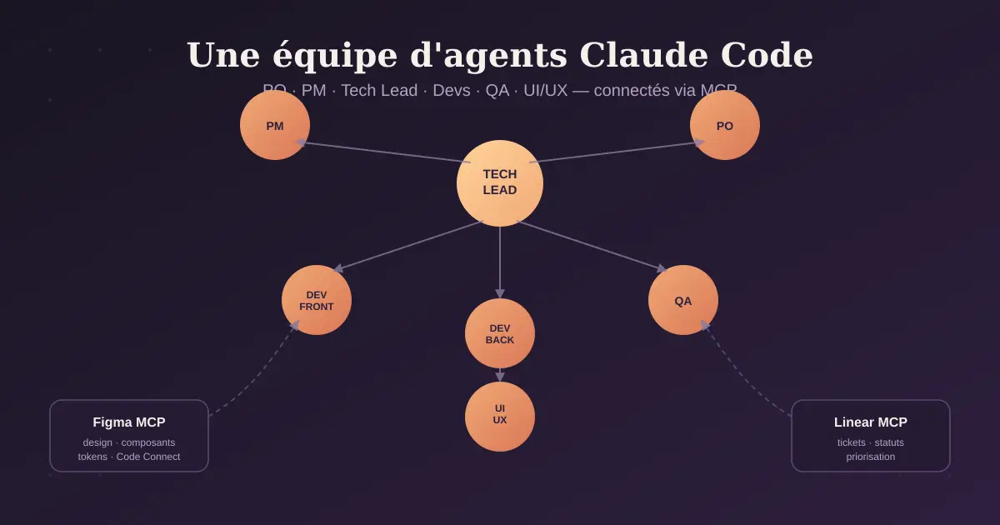

Comment transformer Claude Code en véritable squad produit : un agent par rôle (PO, PM, Tech Lead, Devs, QA, UI/UX), connecté à Figma et Linear via MCP, pour livrer une fonctionnalité de l'idée jusqu'au code testé — sans copier-coller de specs entre outils.
<!-- truncate -->



# Monter une équipe d'agents avec Claude Code : PO, PM, Tech Lead, Devs, Testeurs, UI/UX — de l'idée à l'application livrée

Claude Code n'est plus seulement "un assistant qui code dans le terminal". Avec les **subagents**, les **skills**, les **hooks**, et les serveurs **MCP** (Model Context Protocol), on peut construire quelque chose qui ressemble à une vraie squad produit — sauf que chaque rôle est un agent spécialisé, avec son propre contexte, ses propres outils, et une mission bien définie.

Dans cet article, je vous montre comment j'ai structuré une "équipe" de six agents (PO, PM, Tech Lead, Devs, Testeurs, UI/UX Designer) autour de Claude Code, connectée à **Figma** (pour la partie design) et **Linear** (pour le ticketing), avec un workflow complet pour partir d'une idée et livrer une application fonctionnelle.

---

## 1. Le concept : subagents vs agent teams

Deux briques Claude Code rendent ça possible :

- **Les subagents** : des assistants spécialisés, définis en Markdown avec un frontmatter (nom, description, outils autorisés), stockés dans `.claude/agents/` (au niveau projet) ou `~/.claude/agents/` (au niveau utilisateur). Chaque subagent tourne dans **sa propre fenêtre de contexte**, avec un system prompt dédié et un accès aux outils restreint. Claude délègue automatiquement une tâche au subagent dont la description correspond, ou vous l'invoquez explicitement.
- **Les Agent Teams** (plus récentes, encore en évolution rapide) : un modèle où plusieurs agents collaborent activement, se répartissent le travail et se débloquent mutuellement — un peu comme un sprint Scrum plutôt qu'un simple MapReduce de workers indépendants.

Pour une squad produit complète, l'analogie la plus juste est : **le PO/PM/Tech Lead orchestrent, les devs et testeurs exécutent en parallèle**. On peut commencer avec de simples subagents (plus simple, plus stable) et migrer vers les Agent Teams si le travail exige vraiment des échanges continus entre agents en cours de tâche.

---

## 2. Définir les rôles

Chaque rôle devient un fichier `.claude/agents/<role>.md` avec un frontmatter qui déclare :
- `name` : l'identifiant de l'agent
- `description` : ce qui déclenche sa délégation automatique
- `tools` / `disallowedTools` : ce qu'il a le droit de toucher (un PO ne devrait pas avoir accès à `Write`/`Edit` sur le code, un dev n'a pas forcément besoin d'écrire dans Linear directement, etc.)

### Product Owner (`po.md`)
Rôle : traduire un besoin métier en user stories priorisées, avec critères d'acceptation clairs. Accès : Linear (lecture/écriture), pas d'accès au code.

### Product Manager (`pm.md`)
Rôle : vision produit, arbitrage des priorités, découpage en épics/releases, cohérence globale. Accès : Linear (projets, roadmap), lecture Figma.

### Tech Lead (`tech-lead.md`)
Rôle : traduire les stories en tâches techniques, définir l'architecture, faire les choix techniques (Vue 3/TS, structure des composants, conventions), reviewer le travail des devs. Accès : lecture/écriture code, Linear, Figma (design system, variables).

### Devs (`dev-frontend.md`, `dev-backend.md`)
Rôle : implémenter les tâches assignées, en s'appuyant sur le contexte Figma (composants, tokens) et les specs Linear. Accès : code complet, Figma en lecture, Linear pour mettre à jour le statut des tickets.

### Testeurs (`qa.md`)
Rôle : écrire et exécuter les tests (unitaires, e2e), valider les critères d'acceptation de la story, ouvrir des tickets de bug dans Linear si un écart est détecté. Accès : code (lecture + tests), exécution de commandes (Bash), Linear.

### UI/UX Designer (`ui-ux.md`)
Rôle : ce rôle est un peu particulier puisque Claude Code ne dessine pas dans Figma à votre place de façon autonome — mais avec le serveur MCP Figma, il peut **lire** les maquettes, extraire les composants/variables/design tokens, et même **écrire sur le canvas** (créer/mettre à jour des frames, composants, styles) via la version distante du serveur. Ce rôle sert de pont entre l'intention design et le code : il vérifie la cohérence design system ↔ composants codés (via Code Connect).

Exemple minimal de frontmatter pour le Tech Lead :

```markdown
---
name: tech-lead
description: Traduit les user stories Linear en tâches techniques, définit l'architecture, review le code des devs. À invoquer pour toute décision d'architecture ou de découpage technique.
tools: Read, Grep, Glob, Bash, Edit, Write
---

Tu es le Tech Lead de l'équipe. Stack : Vue 3 + TypeScript (front), Node.js (back).
Avant toute implémentation, tu dois :
1. Lire le ticket Linear associé et ses critères d'acceptation.
2. Vérifier le design Figma lié (composants, variables, contraintes responsive).
3. Découper la story en tâches techniques atomiques, une par composant/endpoint.
4. Assigner chaque tâche au sous-agent dev concerné avec un contexte clair.
```

---

## 3. Connecter les outils externes via MCP

C'est la brique qui transforme cette équipe d'agents en véritable pipeline produit : sans MCP, vos agents "discutent" du produit ; avec MCP, ils **lisent et écrivent** dans vos vrais outils.

### Figma

Figma propose un serveur MCP en deux versions : une **version distante** (recommandée, la plus complète, hébergée par Figma) et une **version desktop** (pour des cas d'usage spécifiques entreprise, nécessite l'app Figma ouverte en local).

Pour la version distante, dans Claude Code :

```bash
claude mcp add --transport http figma https://mcp.figma.com/mcp
```

Puis dans une session Claude Code :

```
/mcp
```
→ sélectionner `figma` → `Authenticate` → autoriser l'accès dans le navigateur.

Une fois connecté, vos agents peuvent :
- extraire le contexte d'un frame ou d'une sélection (composants, variables, layout, contenu FigJam) ;
- générer du code aligné avec vos composants réels grâce à **Code Connect** ;
- écrire directement sur le canvas Figma (créer/mettre à jour des frames, composants) — pratique pour que le Tech Lead ou le designer synchronisent un prototype codé vers Figma pour revue d'équipe.

Le mode de référence le plus fiable reste le **lien Figma** (clic droit sur un frame → "Copy link to selection") passé dans le prompt, plutôt que de compter sur la sélection en direct dans l'app.

### Linear

Linear propose un serveur MCP officiel, hébergé, avec authentification OAuth (pas de token à gérer manuellement) :

```bash
claude mcp add --transport http linear https://mcp.linear.app/mcp
```

Puis `/mcp` dans Claude Code pour déclencher le flow OAuth.

Une fois connecté, vos agents PO/PM/Dev/QA peuvent chercher des tickets, en créer, changer leur statut, commenter, lier des PR — le tout en langage naturel :

```
"Lis le ticket ENG-142, implémente le correctif, puis passe le ticket en
'In Review' et commente avec la liste des fichiers modifiés."
```

---

## 4. Le workflow de A à Z

Voici le déroulé typique pour livrer une fonctionnalité, de l'idée au code testé :

1. **Cadrage (PM)** — Le PM décrit le besoin en langage naturel ; l'agent PM le formule en epic, vérifie qu'il rentre dans la roadmap, et crée le projet Linear correspondant.
2. **Découpage produit (PO)** — L'agent PO transforme l'epic en user stories avec critères d'acceptation, les priorise, les pousse dans Linear.
3. **Design (UI/UX)** — Si un design existe déjà dans Figma, l'agent UI/UX extrait les composants et variables pertinents pour la story et les rattache au ticket. S'il faut prototyper, il peut générer un premier jet de composant codé puis l'envoyer vers Figma comme point de départ de discussion.
4. **Découpage technique (Tech Lead)** — L'agent Tech Lead lit la story Linear + le contexte Figma, définit l'architecture des composants/endpoints, et découpe en tâches techniques assignées aux subagents devs.
5. **Implémentation (Devs)** — Chaque agent dev récupère sa tâche, lit le contexte Figma (tokens, composants) et Linear (specs), implémente, ouvre une PR, met à jour le statut du ticket.
6. **Tests (Testeurs)** — L'agent QA écrit les tests correspondant aux critères d'acceptation, les exécute, et soit valide le ticket soit ouvre un ticket de bug avec repro détaillée.
7. **Revue (Tech Lead)** — Review de code automatisée avant merge, avec vérification de la cohérence avec le design system (Code Connect).

Ce découpage en rôles évite l'écueil classique du "un seul agent qui fait tout dans une seule conversation énorme" : chaque étape tourne dans un contexte propre, ce qui limite la pollution de contexte et améliore la qualité de chaque décision.

---

## 5. CLAUDE.md : la colonne vertébrale partagée

Tous les agents doivent partager un socle commun de règles projet, posé dans un fichier `CLAUDE.md` à la racine :

```markdown
# Projet : [nom de l'app]

## Stack
Frontend : Vue 3 + TypeScript
Backend : Node.js
Design system : Figma (fichier X, lien Y)
Ticketing : Linear (équipe "Product")

## Règles
- Toute implémentation doit être rattachée à un ticket Linear.
- Ne jamais merger sans review du Tech Lead.
- Respecter les tokens de design extraits de Figma (pas de couleurs en dur).
- Écrire un test pour chaque nouveau composant/endpoint.
```

Ce fichier est lu par tous les agents en début de session : c'est ce qui garantit la cohérence entre le PO qui écrit une story, le dev qui l'implémente, et le testeur qui la valide.

---

## 6. Points de vigilance

- **Commencez petit** : trois ou quatre serveurs MCP (Figma, Linear, GitHub) suffisent largement au départ. Chaque serveur ajoute des outils que le modèle doit évaluer à chaque tour ; au-delà d'une dizaine de serveurs, le choix d'outil se dégrade.
- **Les Agent Teams sont encore expérimentales** : token-intensives, avec des limites connues sur la reprise de session. Validez d'abord votre workflow avec de simples subagents avant de migrer.
- **Restreignez les permissions par rôle** : un agent PO n'a aucune raison d'avoir un accès en écriture au code ; un agent QA n'a pas besoin d'écrire dans Figma. Utilisez `tools`/`disallowedTools` dans le frontmatter de chaque subagent.
- **Le lien Figma reste la méthode la plus fiable** pour donner du contexte design à un agent, plutôt que de compter sur une sélection active dans l'app desktop.
- **Vérifiez toujours la provenance des serveurs MCP** avant de les connecter : un serveur qui va chercher du contenu externe peut exposer à des risques d'injection de prompt.

---

## En résumé

Une "équipe" Claude Code, ce n'est pas de la science-fiction : c'est une combinaison de subagents bien scopés (un rôle = un fichier `.claude/agents/*.md`, des outils restreints, une mission claire), d'un `CLAUDE.md` qui fait office de contrat d'équipe, et de deux serveurs MCP (Figma pour le design, Linear pour le ticketing) qui relient vos agents à vos vrais outils de travail. Le résultat : un pipeline où l'idée produit devient ticket, le ticket devient design vérifié, le design devient code, et le code devient testé — sans que vous ayez à copier-coller la moindre spec d'un onglet à l'autre.
