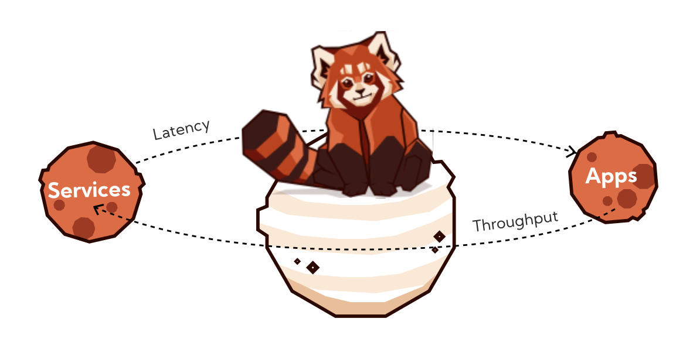

Présentation de RedPanda, au travers du premier cours dédié aux développeurs de la "RedPanda University" que j'ai suivi,
je vous présente les grands principes et les premiers pas dans cet écosystème.


<!-- truncate -->

# RedPanda University courses

## Oh il est trop mignon


RedPanda n’est pas qu’une jolie mascotte, c’est aussi un sacré challenger dans le monde du streaming et surtout un challenger d’Apache Kafka. 
C’est en tout cas son angle d’attaque clairement exposé quand vous lisez le README du projet : 

> Redpanda is a streaming data platform for developers. Kafka® API-compatible. ZooKeeper® free. JVM free. We built it from the ground up to eliminate complexity common to Apache Kafka, improve performance by up to 10x, and make the storage architecture safer, more resilient. The simpler devex lets you can focus on your code (instead of fighting Kafka) and develop new use cases that were never before possible. The business benefits from a significantly lower total cost and faster time to market. A new platform that scales with you from the smallest projects to petabytes of data distributed across the globe!
> 

Github nous indique que le repo a été créé fin 2020 ([https://api.github.com/repos/redpanda-data/redpanda](https://api.github.com/repos/redpanda-data/redpanda)) avec une Stack essentiellement basée sur C++. 
Depuis, la communauté de contributeurs a grandit et l’offre Cloud et Enterprise est disponible, une sacré roadmap en 3 ans.

Avant de commencer à l’utiliser sérieusement et pour se faire une bonne opinion, il est important de comprendre comment il fonctionne et quels sont les cas d’usages. 
Pour cela, RedPanda a créé la [RedPanda University](https://university.redpanda.com/) à l’instar de ce que j’ai déjà pu suivre Chez MongoDB, Redis, Confluent, Neo4j (et que je vous recommande vivement).

## Ouvrez votre livre au chapitre 1 : Streaming Basics


La première partie du cours vous fournira un récapitulatif de ce qu’est un évènement dans les [EDA](https://en.wikipedia.org/wiki/Event-driven_architecture),
dans quels cas d’usage nous les utilisons... 

Si vous êtes familier des architectures event-driven, ce sera juste un petit récapitulatif. 
Puis, vous enchainerez avec des patterns de communication : le point-to-point, la dualité event et command, pub/sub, queues… 
avec un exemple illustré dans le cas de la société Etsy. 
Le cours propose un "landscape" des plateformes de streaming de données, 
avec "pros" et "cons" qu’il vous reste à challenger avec votre expérience. Vous pourrez aussi en trouver un ici [CNCF Streaming landscape](https://landscape.cncf.io/card-mode?category=streaming-messaging&grouping=category). 

La deuxième partie permet d’entrer un peu dans le coeur de la solution. Pour la vision globale, rien de nouveau,
des brokers en cluster, des topics, des partitions, du stockage de données brutes agnostiques de tout format. 
Encore une fois, si vous êtes coutumier d'Apache Kafka passez votre chemin sur les deux premières parties, 
par contre la 3ème partie vous présentera les composants, la stack et leurs particularités. 
Une partie de la vidéo est dédiée à la performance, car Redpanda revendique une amélioration x10 en terme de latences et des transactions 6x plus rapides ! 

Nous tâcherons de tester et de comparer dans des conditions “identiques” plus tard.

D’autres gains de performance sont avancés dans la transformation de données au sein du cluster, puisqu’elle peut être directement réalisée dans la plateforme, 
là où vous seriez amenés à créer des KStreams ou d’utiliser du Ksqldb. 
L’autre découverte est le “[hardware auto tuner](https://docs.redpanda.com/current/reference/rpk/rpk-redpanda/rpk-redpanda-tune/)” qui en fonction de votre matériel va permettre de tirer partie au mieux des capacités de la solution.

Côté fiabilité, on trouve la possibilité d’archiver sur le long terme les données avec des connecteurs intégrés vers des solutions Cloud, 
ce qui évite encore de devoir les gérer soi même.

Si on parle de scalabilité et resilience, elle est comme d’autres, obtenue par le partitionnement et le fait que chaque broker 
ne soit leader que sur certaines partitions de certains topics, permettant la répartition naturelle de la charge et la tolérance aux pannes (par la replication).

# Hands on

## Command Line Interface

Le second cours que je vous conseille permet de mettre vraiment les mains dans la console et de commencer à manipuler un cluster. 
Je vous passe l’installation, vous pourrez retrouver les détails dans [cette documentation](https://docs.redpanda.com/current/get-started/rpk-install/) et on démarre via la cli "rpk" : 

```bash
rpk container start -n 3 --verbose
Checking for a local image...
Downloading latest version of redpanda
Pulling image: vectorized/redpanda:v23.2.7
...
```

et après téléchargement des images nous obtenons très rapidement : 

```bash
Creating network redpanda
Starting cluster...
Waiting for the cluster to be ready...

Cluster started!
NODE-ID  STATUS   KAFKA-ADDRESS    ADMIN-ADDRESS    PROXY-ADDRESS
0        running  127.0.0.1:64033  127.0.0.1:64027  127.0.0.1:64035
1        running  127.0.0.1:64037  127.0.0.1:64036  127.0.0.1:64024
2        running  127.0.0.1:64038  127.0.0.1:64025  127.0.0.1:64028
```

L’export en variable de la liste des brokers permet de continuer d’utiliser la CLI et d’interragir avec le cluster : 

```sh
export RPK_BROKERS="127.0.0.1:64033,127.0.0.1:64037,127.0.0.1:64038"
rpk cluster health
CLUSTER HEALTH OVERVIEW
=======================
Healthy:                     true
Unhealthy reasons:           []
Controller ID:               0
All nodes:                   [0 1 2]
Nodes down:                  []
Leaderless partitions:       []
Under-replicated partitions: []

rpk cluster info
CLUSTER
=======
redpanda.90da6c13-0fb6-4a8e-9357-35ba81e893dc

BROKERS
=======
ID    HOST       PORT
0*    127.0.0.1  64033
1     127.0.0.1  64037
2     127.0.0.1  64038
version: '3.7'
```

La suite du cours permet de manipuler des topics facilement avec les notions de partition et de réplication que vous connaissez déjà, ou que vous aurez découvert avec le premiers cours.

Ici nous créons deux topics **song_plays** et **song_likes** à 6 partitions avec un facteur replication à 1 par exemple.
```bash
rpk topic create song_plays song_likes --partitions 6 --replicas 1
TOPIC       STATUS
song_plays  OK
song_likes  OK
rpk topic list --detailed
song_likes, 6 partitions, 1 replicas
      PARTITION  LEADER  EPOCH  REPLICAS
      0          1       1      [1]
      1          0       1      [0]
      2          2       1      [2]
      3          0       1      [0]
      4          2       1      [2]
      5          1       1      [1]

song_plays, 6 partitions, 1 replicas
      PARTITION  LEADER  EPOCH  REPLICAS
      0          1       1      [1]
      1          2       1      [2]
      2          0       1      [0]
      3          0       1      [0]
      4          1       1      [1]
      5          2       1      [2]
```

Ce que je trouve sympa et simple est la consommation et la production de données avec cette CLI, ici on pousse : 

```bash
rpk topic produce song_likes
{"song_id": 1234, "event": "like"}
{"song_id": 5678, "event": "like"}
Produced to partition 0 at offset 0 with timestamp 1693340516398.
Produced to partition 0 at offset 1 with timestamp 1693340516398.
```

Ou en passant un format de clé-valeur dans une chaîne : 

```bash
rpk topic produce song_likes --format "%k|%v\n"
key1|{"song_id": 1234, "event": "like"}
key2|{"song_id": 5678, "event": "like"}
```

Et le résultat de la consommation montre la différence entre les deux précédentes productions (la clé) : 

```bash
rpk topic consume song_likes
{
  "topic": "song_likes",
  "value": "{\"song_id\": 1234, \"event\": \"like\"}",
  "timestamp": 1693340516398,
  "partition": 0,
  "offset": 0
}
{
  "topic": "song_likes",
  "value": "{\"song_id\": 5678, \"event\": \"like\"}",
  "timestamp": 1693340516398,
  "partition": 0,
  "offset": 1
}
{
  "topic": "song_likes",
  "key": "key1",
  "value": "{\"song_id\": 1234, \"event\": \"like\"}",
  "timestamp": 1693340628321,
  "partition": 2,
  "offset": 0
}
{
  "topic": "song_likes",
  "key": "key2",
  "value": "{\"song_id\": 5678, \"event\": \"like\"}",
  "timestamp": 1693340628321,
  "partition": 5,
  "offset": 0
}
```

La consommation est donc aussi assez simple, vous pouvez choisir la partition que vous souhaitez consommer (ou toutes), 
l’offset, formater la sortie (comme pour la production)…

Idem pour la manipulation de [consumer group](https://docs.redpanda.com/current/reference/rpk/rpk-group/rpk-group/), en les spécifiant, en spécifiant leur offset, en effectuant un reset… et en récupérant toutes leurs informations.

Toutes ces commandes, vous me direz que c’est bien sympa, mais au quotidien vous allez probablement préférer une UI 
et ne pas taper toutes ces commandes. Certes, mais connaître la base c’est aussi sympa et ça peut dépanner quand on ne peut pas brancher d’UI justement,
pour la console ce sera sur cette [page](https://github.com/redpanda-data/console).


## Un peu de code Java

Cette fois, on sort un peu du terminal et on construit un archétype de projet, je l'ai fait en Java, 
utilisez Maven ou Gradle pour construire votre projet et ajouter en dépendance le client apache Kafka.

```xml
    <dependency>
      <groupId>org.apache.kafka</groupId>
      <artifactId>kafka-clients</artifactId>
      <version>latest</version>
    </dependency>
```

Un petit Producer issu du [repository Github](https://github.com/redpanda-data-university/rp-101-redpanda-getting-started) 
de la Redpanda University et on produit un main Java qui va pousser un message, aussitôt lu via la CLI : 

```bash
{
"topic": "greetings",
"key": "key1",
"value": "Hello, World!",
"timestamp": 1693856776889,
"partition": 0,
"offset": 0
}
```

Pas de grand suspens, si je vous dis quand la foulée nous créons un consumer, qui lira ce dernier message.

```bash
Consumed record. key=key1, value=Hello, World!
```

Ce qui peut paraître surprenant, c’est que tout a été fait en utilisant les producers et consumer de la librairie Kafka client.
Etant compatible, Redpanda n'a pas réécrit de librairie Java pour lire et écrire dans son cluster.

Passons donc vite à des choses plus sérieuses !

## Let’s Start Streaming

Si vous suivez le 3ème cours (il y en a d’autres), vous allez streamer !

Le panda roux est sujet à inspirer certaines métaphores, on découvre donc qu’à l’instar d’un panda qui surveille les fruits tombés
de l’arbre qui coule le long de la rivière, il les dévore dès qu’il peut les attrapper ! 

> La donnée c’est pareil, on doit la consommer fraiche et rapidement.


Avant de parler des transformations plus spécifiques à Redpanda, on découvre ou redécouvre les streams stateless ou stateful dans ce cours,
le premier n’a pas besoin de retenir ce qu’il voit et est donc moins gourmand en mémoire tandis que le second aura besoin 
de retenir des informations pour garder la cohérence (application State, comme avec KStream et sa base [RocksDB](https://rocksdb.org) embedded).



La promesse des **Redpanda Data Transform** : co-localiser les transformations stateless directement dans le broker. 
Comment ? En écrivant un peu de NodeJS et en utilisant la CLI pour déployer ces transformations 
(plus de détails sur le moteur d’exécution et les concepts dans [cette page](https://redpanda.com/blog/wasm-architecture)).

Let’s stream avec [ce projet support](https://github.com/redpanda-data-university/rp-102-stream-processing) 
grâce auquel nous allons apprendre à faire une petite transformation de données : 
masquer un numéro de carte de crédit dans un payload depuis un topic source et le propager vers un autre topic. 

Bon, malheureusement pour moi c’est du NodeJS qu'il faut écrire, et ce n’est pas ma tasse de thé, 
mais c’est purement subjectif à ce niveau du projet (ma version de Node à ce moment était supérieure à celle recommandée par le cours, 
une issue et un coup de npm plus tard on peut donc déployer notre première transformation).

Les commentaires vous expliquent bien chaque étape et on se rend vite compte que c'est assez simple et parfait pour des transformations de format.

```js
const {
  SimpleTransform,
  PolicyError,
  PolicyInjection
 } = require("@vectorizedio/wasm-api");
 
 // instantiate a class for registering the transform
 const transform = new SimpleTransform();
 
 // subscribe to the source topic, and read from the Earliest offset
 transform.subscribe([["purchases", PolicyInjection.Earliest]]);
 
 // Set the error handling strategy. In this case, we will skip an event
 // if the transform fails
 transform.errorHandler(PolicyError.SkipOnFailure);
 
 // Create a stateless transform function that masks credit card numbers
 const maskCreditCardNumbers = (record) => {
 
  // The record value comes in as a byte string, so deserialize
  // this to a JSON object
  value = JSON.parse(record.value.toString());
 
  // If the record has a card number, mask the card number
  // i.e. 1111222233334444 will become ************4444
  if (value.hasOwnProperty('card_number')) {
    value['card_number'] = value['card_number'].replace(/\d(?=\d{4})/g, "*")
  }
 
  // In order to write back to Redpanda, we need to serialize the new
  // record back into a byte array
  buf = Buffer.from(JSON.stringify(value))
 
  const newRecord = {
    ...record,
    value: buf,
  };
  return newRecord;
 }
 
 // Register the processRecord handler, which will invoke our card masking
 // function on a batch of records
 transform.processRecord((recordBatch) => {
  const result = new Map();
  const transformedRecord = recordBatch.map(({ header, records }) => {
    return {
      header,
      records: records.map(maskCreditCardNumbers),
    };
  });
 
  // Write the result to a new output topic
  result.set("masked", transformedRecord);
 
  // processRecord function returns a Promise
  return Promise.resolve(result);
 });
 
 exports["default"] = transform;
 
```

Le déploiement via la CLI : 

```bash
rpk wasm deploy --name mask-card mask-card/dist/main.js
```

Notre transformation est donc déployée au sein de notre cluster, puisque nous avions déjà cette configuration de faite :

```bash
rpk cluster config set enable_coproc true
```

Là vous vous dites, "j'ai bien lu wasm dans la commande et pourquoi enable coproc ?". Et oui, Redpanda utilise [WebAssembly](https://webassembly.org/) 
pour la gestion des ces fonctions de transformations et je vous renvoie vers la [documentation de Redpanda à ce sujet](https://docs.redpanda.com/current/develop/data-transforms/how-transforms-work/)
qui vous expliquera comment une VM tourne sur le leader d'une partition pour traiter ses données à tranformer.

> Vous remarquerez (valable en tout casen Janvier 2023), un disclamer indique que ce n'est pas "Production Ready", en tout cas pas conseillé ;-) 

```bash
rpk topic consume coprocessor_internal_topic --offset start -n 1

➜  mask-card git:(main) ✗ rpk topic list
NAME                        PARTITIONS  REPLICAS
coprocessor_internal_topic  1           1
purchases                   4           1
```

Maintenant petit instant magique, on produit de la donnée dans le topic et elle apparait masquée dans le topic de sortie : 

```bash
➜  mask-card git:(main) ✗ rpk topic produce purchases
{"user_id": 123, "card_number": "1111222233334444"}
Produced to partition 3 at offset 0 with timestamp 1694462899860.

➜  mask-card git:(main) ✗ rpk topic list
NAME                        PARTITIONS  REPLICAS
coprocessor_internal_topic  1           1
purchases                   4           1
purchases._masked_          4           1

```

```bash
rpk topic urchases._masked_
{
  "user_id": 123,
  "card_number": "************4444"
  }
```

Pour supprimer notre transformation rien de plus simple, c’est un remove.

```bash
rpk wasm remove mask-card
```

### Un peu de Connect

Pour le moment, nous nous sommes concentrés sur le coeur de Redpanda et avons eu des interactions de consommation et de production/transformation avec ses brokers.
Vous le savez, dans les systèmes d’information, la donnée transite. Elle a une source, elle subit des enrichissements, 
elle peut croiser des affluents et se déverser à plein d’endroit. 
Sur son chemin, elle va traverser des couches technologiques différentes, alors comment facilement interconnecter cette hétérogénéité ? 
C’est là qu’intervient [Kafka Connect](https://kafka.apache.org/documentation.html#connect) et les [transformations possibles](https://docs.confluent.io/platform/current/connect/transforms/overview.html).

Rien de différent non plus par rapport à Apache Kafka ici, je vous laisse découvrir Connect avec le précédent lien.

### Et de KStreams

Puisque les transformations natives au cluster que nous avons vues ou les connectors ne suffisent pas à couvrir tous 
les usescases possibles avec les données d’un cluster, Kafka Streams permet de construire des applications plus riches
qui pourront croiser, joindre des données internes au cluster et réaliser des opérations plus complexes. 

Pour plus d’informations, référez vous à la [documentation officielle](https://kafka.apache.org/documentation/streams/).

Le hands-on de RedPanda dédié au Streams va vous permettre de réaliser une opération assez simple : 
compter le nombre de commandes par utilisateur qui transitent sur un topic. 
Un simple groupBy associé à un Count, qui donnera une opération dites “statefull” dans le jargon Kafka. 
Ce qui va nécessiter de créer un [state store](https://docs.confluent.io/platform/current/streams/architecture.html#streams-architecture-state) 
pour conserver l’état des données qu’on agrège et compte. Je vous conseille de lire et relire la documentation associée pour bien comprendre le concept (lié à la compaction) et les mécanisme de chargement en mémoire (RocksDB), de haute disponibilité et de tolérance associé.


Ainsi dans notre exemple, la production de ces évènements : 

```bash
➜ alias rpk="docker exec -ti redpanda-1 rpk"
rpk topic produce purchases --format "%k,%v\n"
user1,purchase_event
user1,purchase_event
user2,purchase_event
```

va donner ce résultat dans l’application de test

```bash
Starting Kafka Streams application
[purchases]: user2, 1
[purchases]: user1, 1
[purchases]: user1, 2
[purchases]: user1, 3

```

```java
public static Topology build() {
    StreamsBuilder builder = new StreamsBuilder();

    builder.stream("purchases", Consumed.with(Serdes.String(), Serdes.String()))
        // group by the key
        .groupByKey(Grouped.with(Serdes.String(), Serdes.String()))
        // count per key
        .count()
        // convert the table to a stream
        .toStream()
        // print the output
        .print(Printed.<String, Long>toSysOut().withLabel("purchases"));

    return builder.build();
  }
```

Cette simple topologie nous a permis d’avoir ce résultat. 
Si vous connaissez Kafka et les Streams, vous voyez donc que c’est scrupuleusement la même chose et vous retrouverez 
votre State store créé sous forme de topic compact au sein du cluster.

```bash
rpk topic list
NAME                                                          PARTITIONS  REPLICAS
local-dev-KSTREAM-AGGREGATE-STATE-STORE-0000000001-changelog  4           1
purchases                                                     4           1
```

## Un use case plus complet

Pour terminer ce survol de toutes les possibilités/compatibilités de Redpanda, on termine par le cours dédié à un cas d’usage de détection de fraude. 
Un cas d’usage déjà couvert avec Apache Kafka depuis longtemps et dans de nombreux contextes métier : [https://www.confluent.io/fr-fr/use-case/fraud-detection/](https://www.confluent.io/fr-fr/use-case/fraud-detection/)

Cet exercice est l’occasion de découvrir que Redpanda possède un schéma registry interne au cluster, 
ce qui diffère de l’écosystème Confluent autour de Kafka : [https://docs.confluent.io/platform/current/schema-registry/index.html](https://docs.confluent.io/platform/current/schema-registry/index.html)

Nous configurons donc ensuite les topics nécessaires, créons le connector source à une base Postgres et spécifiquement à la table des “achats”.

```bash
docker exec -ti kafka-connect \
    curl -XPUT localhost:8083/connectors/purchases-source/config \
    -H "Content-Type: application/json" \
    -d '
    {
     "connector.class": "io.confluent.connect.jdbc.JdbcSourceConnector",
     "connection.url": "jdbc:postgresql://postgres:5432/root?user=root&password=secret",
     "mode": "incrementing",
     "incrementing.column.name": "id",
     "topic.prefix": "",
     "table.whitelist": "purchases",
     "value.converter": "io.confluent.connect.avro.AvroConverter",
     "value.converter.schema.registry.url": "http://redpanda:8081",
     "transforms": "SetValueSchema,ValueToKey,ExtractKey",
     "transforms.SetValueSchema.type": "org.apache.kafka.connect.transforms.SetSchemaMetadata$Value",
     "transforms.SetValueSchema.schema.name": "com.example.model.Purchase",
     "transforms.ValueToKey.type": "org.apache.kafka.connect.transforms.ValueToKey",
     "transforms.ValueToKey.fields": "credit_card",
     "transforms.ExtractKey.type": "org.apache.kafka.connect.transforms.ExtractField$Key",
     "transforms.ExtractKey.field": "credit_card"
    }'
```

Le projet Java contient déjà la “topology” et les déclarations de streams qui vont filtrer, 
compter les opérations sur une fenêtre de temps pour tenter de détecter d’éventuelles fraudes.

Notre Connector source nous a permis de créer un schéma qui est déjà stocké dans le registre.

```sh
docker exec -ti redpanda-1 curl localhost:8081/subjects/purchases-value/versions/1 | jq -r '.schema' | jq '.' > src/main/avro/purchase.avsc
```

On en récupère le contenu en vue d’une compilation avec la génération d’une classe Purchase et de ce qu’il faut pour la sérialiser/déserialiser.

```java
   private int id;
   private java.lang.CharSequence category;
   private java.lang.Double amount;
   private java.lang.CharSequence credit_card;
   private java.lang.Double distance_from_billing_zip;
   private java.time.Instant timestamp;
```

On créé ensuite en base de données les conditions nécessaires à la levée d’une alerte (à savoir au moins 3 commandes en moins de 60 secondes avec la même carte bancaire). 
Une alerte est levée et la création d’un nouveau schéma correspondant.

On peut aussi visualiser le topic de travail du state store de notre KStream : 

```sh
rpk topic list
NAME                                                            PARTITIONS  REPLICAS
_connect-configs                                                1           1
_connect-offsets                                                25          1
_connect-status                                                 5           1
_schemas                                                        1           1
alerts-avro                                                     4           1
alerts-json                                                     4           1
local-dev-0-KSTREAM-AGGREGATE-STATE-STORE-0000000001-changelog  4           1
purchases                                                       4           1
```

et visualiser notre alerte : 

```json
rpk topic consume -n 1 alerts-avro
{
  "topic": "alerts-avro",
  "key": "1111-2222-3333-4444",
  "value": "\u0000\u0000\u0000\u0000\u0002\u0002\u0026high_purchase_count\u0002\u00261111-2222-3333-4444\u0002\ufffd\ufffd\ufffd\ufffd\ufffdb",
  "timestamp": 1695068363227,
  "partition": 1,
  "offset": 0
}
```

Voilà pour un premier tour de Redpanda si vous n'aviez pas encore creusé cette solution, n'hésitez plus !

[](https://www.linkedin.com/sharing/share-offsite/?url=https%3A%2F%2Fzatsit-blog.web.app%2Fblog%2Fredpanda-introduction%2F)
[](https://twitter.com/intent/tweet?text=Pr%C3%A9sentation%20de%20RedPanda%2C%20au%20travers%20du%20premier%20cours%20d%C3%A9di%C3%A9%20aux%20d%C3%A9veloppeurs%20de%20la%20%22RedPanda%20University%22%20que%20j%27ai%20suivi%2C%0Aje%20vous%20pr%C3%A9sente%20les%20grands%20principes%20et%20les%20premiers%20pas%20dans%20cet%20%C3%A9cosyst%C3%A8me&url=https%3A%2F%2Fzatsit-blog.web.app%2Fblog%2Fredpanda-introduction%2F)
