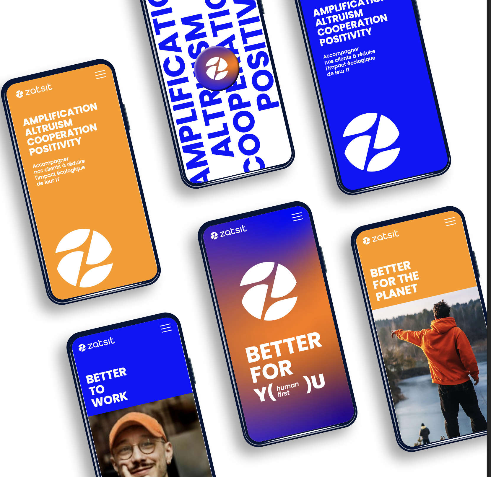

Bienvenue sur le site, on se présente !

<!-- truncate -->

## Bienvenue sur le blog de Zatsit !

## Là où Compétences Techniques et Engagement Écologique et sociétal se Rencontrent

Bienvenue sur le blog Zatsit, votre espace dédié à la découverte des talents exceptionnels qui font de notre entreprise un leader dans le secteur des services numériques. Chez nous, la croissance professionnelle et technologique s'harmonise parfaitement avec un engagement fort envers l'environnement et le bien-être de notre communauté.

## Découvrez Nos Arbres de Compétences

Chaque collaborateur chez Zatsit est comme un arbre, enraciné dans la technologie et s'épanouissant avec des compétences techniques exceptionnelles. Explorez nos arbres pour découvrir :

- 🌳 Le Chêne de l'Ancienneté : Nos vétérans, symboles de stabilité et d'expérience.
- 🎋 Le Bambou de la Montée en Compétence Rapide : Ceux qui grandissent rapidement, embrassant de nouvelles technologies avec agilité.
- 🌿 Le Saule de la Souplesse et de l'Adaptabilité : Des esprits flexibles prêts à s'adapter aux défis du monde numérique.
Expertises Techniques à la Pointe

Découvrez comment nos collaborateurs, forts de leur expérience et de leur formation continue, repoussent sans cesse les limites de l'innovation. Nous sommes fiers de notre équipe qui excelle dans des domaines tels que :

- 🚀 Intelligence Artificielle : Des esprits créatifs qui transforment des données en solutions intelligentes.
- 💻 Développement Full Stack : Des développeurs polyvalents capables de concevoir des expériences utilisateur exceptionnelles.
- 🌐 Cybersécurité : Des gardiens vigilants qui protègent nos clients des menaces numériques.

## Initiatives RSE et Impact Écologique

Chez Zatsit, notre engagement envers la Responsabilité Sociale des Entreprises (RSE) ne se limite pas à l'informatique. Explorez nos initiatives qui façonnent un avenir durable :

- 🌍 Projets RSE Innovants : Découvrez comment nous utilisons la technologie pour créer un impact positif dans nos communautés locales et au-delà.
- ♻️ Pratiques Écologiques au Quotidien : De la réduction de notre empreinte carbone à l'utilisation de technologies vertes, nous œuvrons pour un avenir plus durable.
- 🌱 Formation Écologique Continue : Nos collaborateurs sont constamment informés des meilleures pratiques pour minimiser notre impact sur la planète.

## Laissez-vous Inspirer par Nos Collaborateurs

Parcourez nos articles de blog pour entendre les voix de nos collaborateurs, découvrir leurs passions, leurs projets personnels et la manière dont ils contribuent à notre mission commune. Chez Zatsit, nous croyons que chaque talent contribue à une forêt prospère.

Rejoignez-nous dans cette aventure passionnante où compétences techniques et engagement écologique s'entrelacent pour créer un monde numérique plus intelligent et plus durable. Explorez, apprenez, inspirez-vous !

Bienvenue chez Zatsit, où la croissance professionnelle rencontre la responsabilité environnementale.
