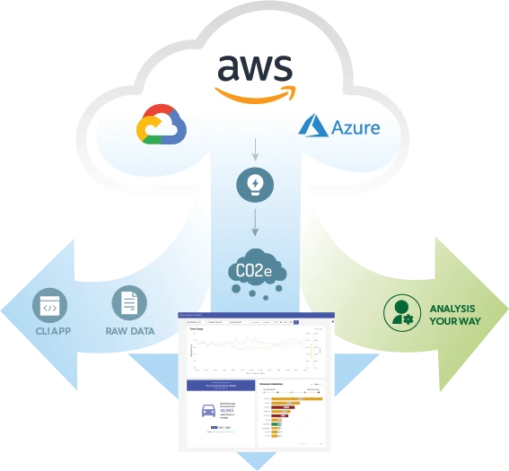

Présentation de Cloud Carbon Footprint, l'outil qui calcule l'empreinte carbone de vos projets Cloud. On vous explique en détail comment le configurer pour AWS.

<!-- truncate -->

# Cloud Carbon Footprint, l'outil qui calcule l'empreinte carbone de vos projets Cloud

## Introduction

Pendant de nombreuses années, les firmes technologiques autour du Cloud se sont lancées dans une course effrénée pour proposer des services toujours plus performants. Mais cette course a un coût, et il n'est pas seulement financier.

### Le Cloud, qu'est-ce que c'est ?

Le Cloud, c'est avant tout des serveurs, hébergés dans des datacenters, alimentés en électricité, refroidis en permanence par des climatisations, connecté à Internet. Et comme le Cloud ne dort pas, ces serveurs tournent 24h/24 et 7j/7 pour assurer un service continu, peu importe où vous vous trouvez dans le monde.

### Le Cloud, c'est aussi une empreinte carbone

En Europe en 2020, la consommation électrique des datacenters est estimée à 81 TWh soit 2,5 % de la consommation totale du continent. (1)

Dans le monde en 2022, les datacenters ont consommé 460 térawattheures (TWh), ce qui constitue près de 2% de la demande mondiale totale en électricité.

On comprend très vite que le Cloud a un impact environnemental non négligeable. C'est pourquoi il est important d'être sensibilité et prêter une attention particulière à l'empreinte déposée par nos projets Cloud.

1. https://www.journaldunet.com/smart-city/1512549-perspectives-sur-l-empreinte-carbone-du-cloud-et-des-datacenters/

### L'impact, au coeur de nos défis

Chez zatsit, nous sommes convaincus que l'impact environnemental de nos projets est un enjeu majeur. C'est pourquoi nous sommes sensibles ou sensibilisés sur ces sujets et nous cherchons à proposer des solutions qui permettent de réduire cet impact chez nous, mais aussi chez nos clients.

## Les origines

## Zoom sur Cloud Carbon Footprint

Cloud Carbon Footprint est un outil open source qui permet de calculer l'empreinte carbone de vos projets Cloud. Il est compatible avec les principaux fournisseurs de Cloud, dont AWS, Azure et GCP. Dans cet article nous allons vous présenter l'outil et vous expliquer comment le configurer pour AWS.

## Bibliographie

* [Cloud Carbon Footprint](https://cloudcarbonfootprint.io/)
* [GitHub - Cloud Carbon Footprint](https://github.com/cloud-carbon-footprint/cloud-carbon-footprint)
* [Démo - Cloud Carbon Footprint](https://demo.cloudcarbonfootprint.org/)
